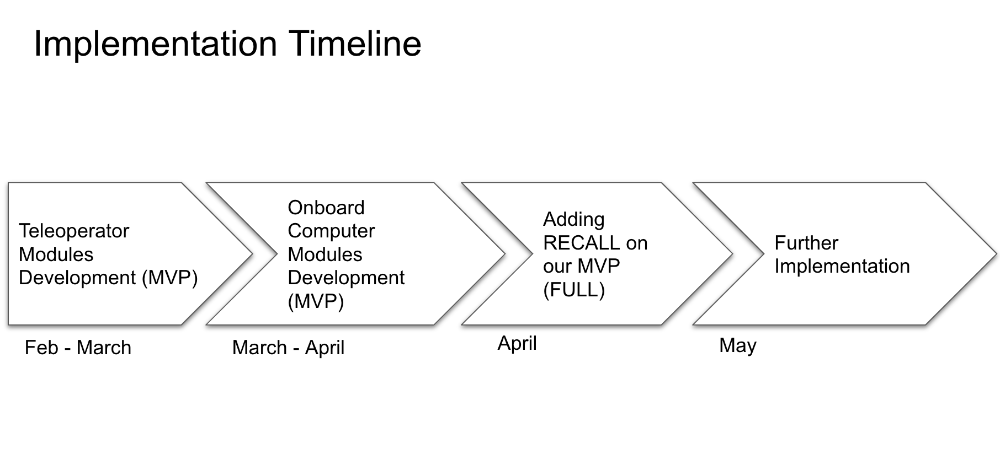

# Few-Shot Continuall Learning System for Robot Semantic Segmentation

### Team Member:
- Roger Qiu
- Eason Lu 
- Marc Huang
  
### Advisor:
- Prof. Kris Hauser
- Prof. Yuxiong Wang

### TO-DO (Frontend):
- [x] Handle MPEG-DASH Protocol
- [x] Integrate Snap-shot function
- [ ] Integrate Interactive Segmentation
- [ ] Save annotated image to local disk
- [ ] Send data to on-board computer
- [ ] Adjust styles

### System Structure:

### Frontend Sketch:

### Develop Timeline:

Feb – March 20th: Implement user interface; connect interactive segmentation component and robot camera to our user interface.  

March 5th – April 15th :   implement CAPS and PIFS; connect user interface to our models.  

April – May: Testing; Add RECALL on it.  

May - ~: Further implementation on RGB-D input.  

